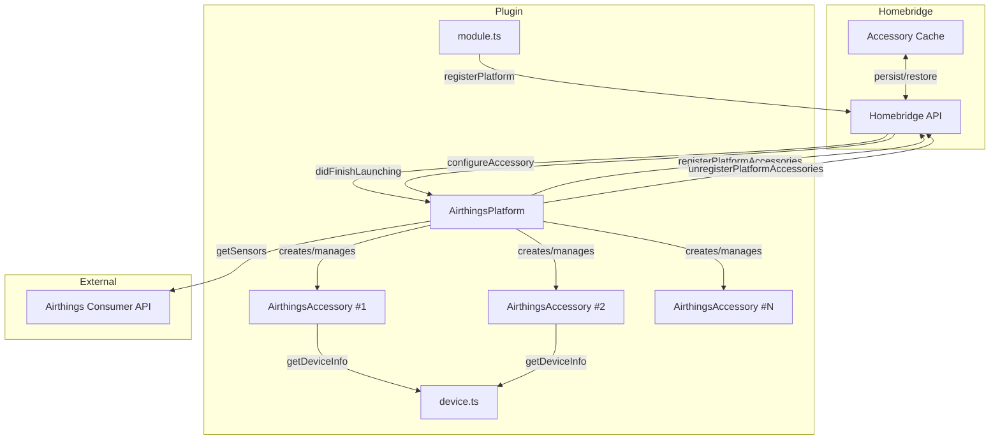
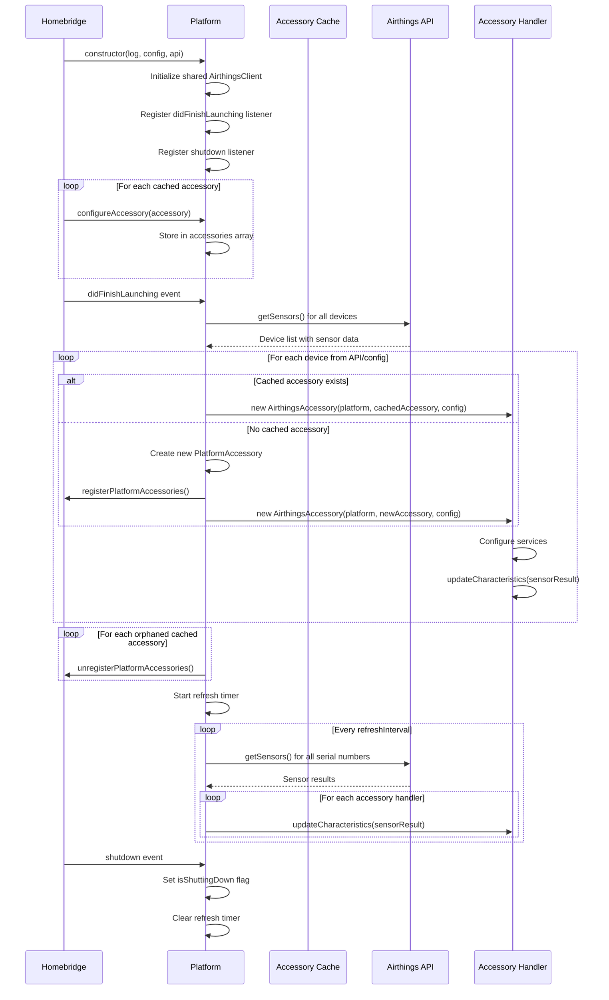
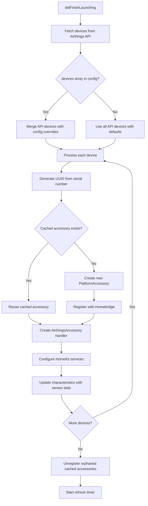

# Design Document

## Overview

This design describes the refactoring of the Homebridge Airthings plugin from an Accessory-style architecture to a Platform-style architecture. The new design follows Homebridge best practices by implementing `DynamicPlatformPlugin`, separating platform and accessory concerns, and supporting multiple devices with a shared API client.

The refactoring maintains full backward compatibility with existing HomeKit services while enabling multi-device support and automatic device discovery from the Airthings Consumer API.

## Architecture



## Components and Interfaces

### Module Entry Point (module.ts)

The entry point registers the platform with Homebridge.

```typescript
import { API } from 'homebridge';
import { PLATFORM_NAME, PLUGIN_NAME } from './settings.js';
import { AirthingsPlatform } from './platform.js';

export default (api: API) => {
    api.registerPlatform(PLUGIN_NAME, PLATFORM_NAME, AirthingsPlatform);
};
```

### Settings (settings.ts) - New File

Constants for plugin identification. This is a new file to be created during the refactor.

```typescript
export const PLATFORM_NAME = 'Airthings';
export const PLUGIN_NAME = 'homebridge-airthings';
```

### Platform Configuration (config.ts) - New File

```typescript
interface AirthingsPlatformConfig extends PlatformConfig {
    clientId?: string;
    clientSecret?: string;
    refreshInterval?: number;
    debug?: boolean;
    devices?: AirthingsDeviceConfig[];
}

interface AirthingsDeviceConfig {
    serialNumber?: string;
    name?: string;
    batteryDisabled?: boolean;
    co2AirQualityDisabled?: boolean;
    humidityAirQualityDisabled?: boolean;
    pm25AirQualityDisabled?: boolean;
    radonAirQualityDisabled?: boolean;
    vocAirQualityDisabled?: boolean;
    co2DetectedThreshold?: number;
    radonLeakThreshold?: number;
}
```

### Platform Class (platform.ts)

```typescript
interface AirthingsPlatform extends DynamicPlatformPlugin {
    readonly log: Logging;
    readonly config: AirthingsPlatformConfig;
    readonly api: API;
    readonly Service: typeof Service;
    readonly Characteristic: typeof Characteristic;
    
    // Cached accessories restored from disk
    readonly accessories: PlatformAccessory[];
    
    // Active accessory handlers
    readonly accessoryHandlers: Map<string, AirthingsAccessory>;
    
    // Shared API client
    readonly airthingsClient: AirthingsClient;
    
    // Refresh timer reference
    refreshTimer?: NodeJS.Timeout;
    
    // Flag to prevent API calls after shutdown
    isShuttingDown: boolean;
    
    // Methods
    configureAccessory(accessory: PlatformAccessory): void;
    discoverDevices(): Promise<void>;
    refreshAllDevices(): Promise<void>;
}
```

### Accessory Handler Class (accessory.ts)

```typescript
interface AirthingsAccessory {
    readonly platform: AirthingsPlatform;
    readonly accessory: PlatformAccessory;
    readonly config: AirthingsDeviceConfig;
    readonly deviceInfo: AirthingsDeviceInfo;
    
    // Services
    readonly informationService: Service;
    readonly batteryService?: Service;
    readonly airQualityService: Service;
    readonly temperatureService?: Service;
    readonly humidityService?: Service;
    readonly carbonDioxideService?: Service;
    readonly airPressureService?: Service;
    readonly radonService?: Service;
    
    // Methods
    updateCharacteristics(sensorResult: SensorResult): void;
    getAirQuality(sensorResult: SensorResult): number;
}
```

### Accessory Context

```typescript
interface AirthingsAccessoryContext {
    serialNumber: string;
    deviceConfig: AirthingsDeviceConfig;
}
```

## Data Models

### Configuration Schema (config.schema.json)

The configuration schema must be updated to support the platform architecture with multi-device configuration.

**Key Changes from Accessory to Platform:**
- `pluginType` changes from `"accessory"` to `"platform"`
- `clientId` and `clientSecret` move to platform level (shared across all devices)
- New `devices` array with per-device configuration
- Each device entry supports all existing per-device options

```json
{
  "pluginAlias": "Airthings",
  "pluginType": "platform",
  "schema": {
    "type": "object",
    "properties": {
      "clientId": { "type": "string", "required": true },
      "clientSecret": { "type": "string", "required": true },
      "refreshInterval": { "type": "number", "default": 150 },
      "debug": { "type": "boolean", "default": false },
      "devices": {
        "type": "array",
        "items": {
          "type": "object",
          "properties": {
            "serialNumber": { "type": "string" },
            "name": { "type": "string" },
            "batteryDisabled": { "type": "boolean" },
            "co2AirQualityDisabled": { "type": "boolean" },
            "humidityAirQualityDisabled": { "type": "boolean" },
            "pm25AirQualityDisabled": { "type": "boolean" },
            "radonAirQualityDisabled": { "type": "boolean" },
            "vocAirQualityDisabled": { "type": "boolean" },
            "co2DetectedThreshold": { "type": "number" },
            "radonLeakThreshold": { "type": "number" }
          }
        }
      }
    }
  }
}
```

**Design Decision**: The `devices` array is optional. When empty or missing, the platform auto-discovers all devices from the Airthings API and creates accessories with default settings. This provides a zero-configuration experience for users who want all their devices with default settings.

**Design Decision**: The schema uses Homebridge UI's array support with expandable sections, allowing users to add/remove devices through the UI (Requirement 7.4, 7.5).

### Platform Lifecycle Flow



**Design Decision**: The `isShuttingDown` flag ensures that any in-flight or scheduled API calls are prevented after shutdown is initiated, satisfying Requirement 9.2.

### Device Discovery Logic



## Correctness Properties

*A property is a characteristic or behavior that should hold true across all valid executions of a system-essentially, a formal statement about what the system should do. Properties serve as the bridge between human-readable specifications and machine-verifiable correctness guarantees.*

### Property 1: UUID Generation Consistency

*For any* serial number string, generating a UUID using `api.hap.uuid.generate()` multiple times SHALL produce the same UUID value.

**Validates: Requirements 3.5**

### Property 2: Accessory Caching

*For any* PlatformAccessory passed to `configureAccessory()`, that accessory SHALL be stored in the platform's accessories array and be retrievable by its UUID.

**Validates: Requirements 1.3, 3.1**

### Property 3: Device-to-Accessory Mapping

*For any* devices array of length N in the configuration, exactly N PlatformAccessory instances SHALL be created or reused (one per device).

**Validates: Requirements 2.3**

### Property 4: Auto-Discovery

*For any* platform configuration with an empty or missing `devices` array, and an Airthings API response containing M devices, exactly M PlatformAccessory instances SHALL be created with default settings.

**Validates: Requirements 2.2**

### Property 5: Cached Accessory Reuse

*For any* device configuration where a cached accessory exists with a matching UUID (generated from the device's serial number), the platform SHALL reuse that cached accessory rather than creating a new one.

**Validates: Requirements 3.2**

### Property 6: New Accessory Registration

*For any* device configuration where no cached accessory exists with a matching UUID, the platform SHALL create a new PlatformAccessory and call `api.registerPlatformAccessories()`.

**Validates: Requirements 3.3**

### Property 7: Orphan Accessory Cleanup

*For any* cached accessory whose UUID does not match any device in the configuration AND does not match any device returned from the Airthings API, the platform SHALL call `api.unregisterPlatformAccessories()` to remove it.

**Validates: Requirements 3.4**

### Property 8: Service Configuration by Device Sensors

*For any* device with a specific set of supported sensors (as determined by serial number prefix), the Accessory Handler SHALL configure exactly the corresponding HomeKit services (e.g., a device with CO2 sensor gets CarbonDioxideSensor service).

**Validates: Requirements 4.3**

### Property 9: Characteristic Updates from Sensor Data

*For any* SensorResult containing sensor values, calling `updateCharacteristics()` on the Accessory Handler SHALL update the corresponding HomeKit characteristic values to match the sensor data.

**Validates: Requirements 4.4**

### Property 10: Sensor Result Distribution

*For any* batch of SensorResults from the Airthings API, each result SHALL be delivered to the Accessory Handler whose device serial number matches the result's serial number.

**Validates: Requirements 5.3**

### Property 11: Air Quality Calculation

*For any* combination of sensor values (CO2, humidity, PM2.5, radon, VOC), the `getAirQuality()` method SHALL return the correct AirQuality enum value based on the defined thresholds:
- CO2: Good (<800), Fair (800-999), Poor (≥1000)
- Humidity: Good (30-59%), Fair (25-29% or 60-69%), Poor (<25% or ≥70%)
- PM2.5: Good (<10), Fair (10-24), Poor (≥25)
- Radon: Good (<100), Fair (100-149), Poor (≥150)
- VOC: Good (<250), Fair (250-1999), Poor (≥2000)

**Validates: Requirements 6.2**

### Property 12: Disabled Sensor Configuration

*For any* device configuration with specific sensors disabled (e.g., `co2AirQualityDisabled: true`), those sensors SHALL NOT contribute to the Air Quality calculation and their characteristics SHALL NOT be added to the Air Quality service.

**Validates: Requirements 6.3**

### Property 13: Missing Credentials Validation

*For any* platform configuration where `clientId` OR `clientSecret` is missing or empty, the platform SHALL NOT initialize any devices and SHALL NOT make API calls.

**Validates: Requirements 8.1, 8.2**

### Property 14: Missing Serial Number Validation

*For any* device configuration in the `devices` array where `serialNumber` is missing or empty, that device SHALL be skipped and no accessory SHALL be created for it.

**Validates: Requirements 8.3**

### Property 15: API Error Handling

*For any* error returned from the Airthings API during sensor refresh, all accessory handlers SHALL have their StatusActive characteristics set to false.

**Validates: Requirements 8.4**

### Property 16: Shutdown Prevents API Calls

*For any* platform instance where the shutdown event has been received, subsequent calls to `refreshAllDevices()` SHALL NOT make any Airthings API requests.

**Validates: Requirements 9.2**

## Error Handling

### Configuration Errors

| Error Condition | Behavior |
|----------------|----------|
| Missing `clientId` | Log error, skip all device initialization |
| Missing `clientSecret` | Log error, skip all device initialization |
| Missing `serialNumber` in device config | Log warning, skip that device only |
| Invalid `refreshInterval` (non-integer) | Log warning, use default (150s) |
| `refreshInterval` < 60 | Log warning, use minimum (60s) |
| Invalid `co2DetectedThreshold` | Log warning, use default (1000) |
| Invalid `radonLeakThreshold` | Log warning, disable radon leak sensor |

### API Errors

| Error Condition | Behavior |
|----------------|----------|
| Authentication failure | Log error, set all accessories inactive |
| Rate limit exceeded (429) | Log warning with refresh interval guidance, set accessories inactive |
| Network error | Log error, set accessories inactive, retry on next interval |
| No sensor results returned | Log warning, set accessories inactive |
| Partial results (some devices missing) | Log warning for missing devices, update available devices |

### Runtime Errors

| Error Condition | Behavior |
|----------------|----------|
| Accessory handler throws during update | Log error, continue with other accessories |
| UUID generation fails | Log error, skip that device |

## Testing Strategy

### Unit Tests

Unit tests verify specific examples and edge cases:

1. **Platform initialization**: Verify platform creates shared API client
2. **Configuration parsing**: Verify config with/without devices array
3. **UUID generation**: Verify consistent UUIDs for known serial numbers
4. **Device info lookup**: Verify correct model/sensors for each serial prefix
5. **Service creation**: Verify correct services for each device type
6. **Characteristic UUIDs**: Verify custom Radon and VOC UUIDs match expected values
7. **Shutdown handling**: Verify timer is cleared on shutdown event

### Property-Based Tests

Property-based tests verify universal properties across generated inputs using a PBT library (e.g., fast-check for TypeScript):

1. **Property 1**: Generate random serial numbers, verify UUID consistency
2. **Property 2**: Generate random accessories, verify caching behavior
3. **Property 3**: Generate device arrays of various lengths, verify accessory count
4. **Property 5-7**: Generate combinations of cached accessories and device configs, verify lifecycle behavior
5. **Property 11**: Generate random sensor values, verify air quality calculation matches thresholds
6. **Property 12**: Generate configs with various disabled sensors, verify exclusion
7. **Property 13-14**: Generate configs with missing fields, verify validation
8. **Property 16**: Generate shutdown scenarios, verify no API calls after shutdown

### Test Configuration

- Property-based tests: Minimum 100 iterations per property
- Each property test tagged with: `Feature: platform-plugin-refactor, Property N: {property_text}`
- Use fast-check library for TypeScript property-based testing
- Mock Airthings API client for unit and property tests

